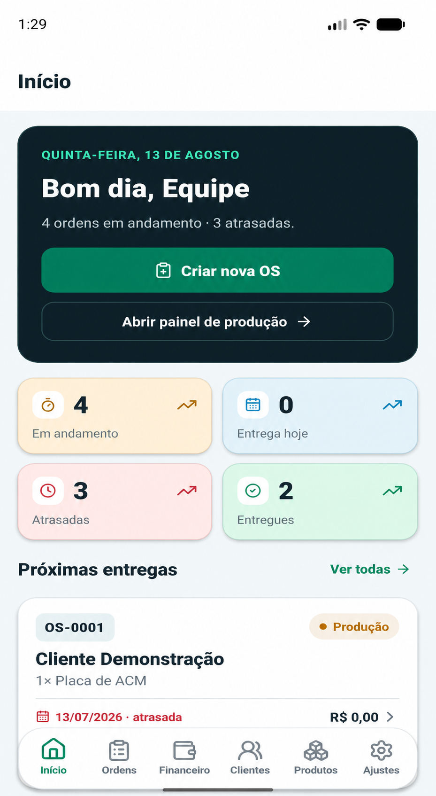
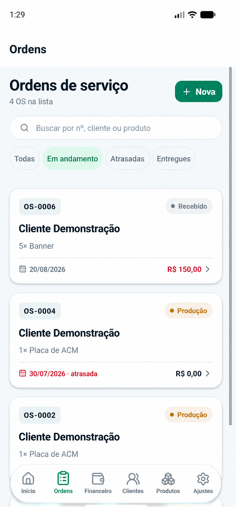
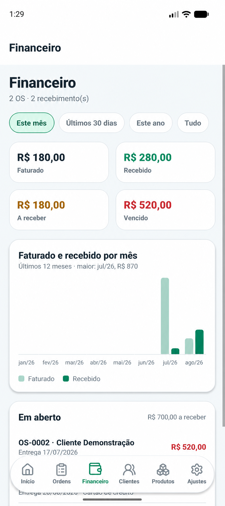
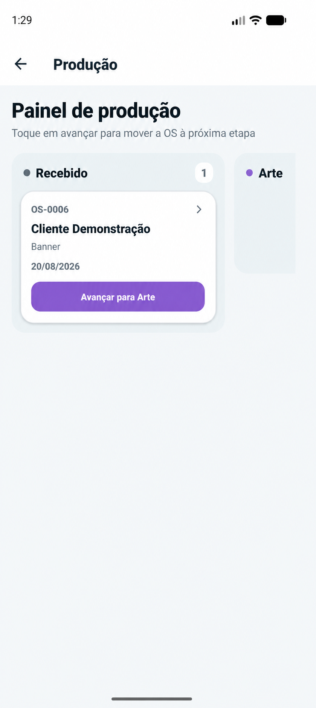

<div align="center">
  
  <h1>Fluxo</h1>
  <p><strong>Ordens de serviço, produção e financeiro no mesmo fluxo.</strong></p>
  <p>Plataforma web + aplicativo para empresas de comunicação visual.</p>
  <p>
    <a href="https://fluxo.web.app" target="_blank" rel="noopener noreferrer"><strong>Acessar demonstração</strong></a>
    ·
    <a href="#visão-do-produto">Conhecer o produto</a>
    ·
    <a href="#aplicativo-mobile">Ver o aplicativo</a>
  </p>
</div>

---

## Acesso de demonstração

| Campo | Credencial |
|---|---|
| E-mail | `teste@teste.com` |
| Senha | `contatest*` |

> A conta é exclusiva para demonstração. Use apenas dados fictícios.

## Visão do produto

O **Fluxo** acompanha uma ordem de serviço do orçamento à entrega. Atendimento,
produção e financeiro trabalham sobre a mesma informação, sem planilhas paralelas
ou atualização duplicada.

O produto tem duas interfaces conectadas ao mesmo banco de dados:

- **Web:** visão completa da operação, Kanban, financeiro, cadastros, relatórios e exportações.
- **Mobile:** rotina de balcão e produção no Android/iOS, com criação e consulta de OS, mudança de etapa e compartilhamento de PDF.

Cada empresa recebe uma instalação Firebase isolada, mantendo os dados de clientes
e pedidos separados por operação.

## Aplicativo mobile

<p align="center">
  
  &nbsp;
  
  &nbsp;
  
  &nbsp;
  
</p>

<p align="center"><sub>Aplicativo real em execução no Android. Dados ilustrativos e nomes anonimizados.</sub></p>

## Da entrada à entrega

`Recebido` → `Arte` → `Produção` → `Pronto` → `Entregue`

1. O atendimento cadastra o cliente e cria a OS com produtos, medidas, quantidades e prazo.
2. O sistema calcula itens por metro quadrado ou unidade e registra o valor acordado.
3. A produção movimenta o pedido entre etapas pelo Kanban no site ou pelo aplicativo.
4. A equipe acompanha atrasos, chama o cliente no WhatsApp e compartilha a OS em PDF.
5. O financeiro registra recebimentos e acompanha faturado, recebido, saldo e margem.

## Recursos principais

### Ordens de serviço

- Numeração sequencial e sem duplicidade (`OS-0001`, `OS-0002`...).
- Múltiplos itens por OS, com cálculo por m² ou unidade.
- Prazo, observações de produção, link externo da arte e histórico de alterações.
- Busca por número, cliente ou produto e filtros por status e atraso.
- Impressão e compartilhamento da OS em PDF.
- Cancelamento sem apagar o histórico ou abrir lacunas na numeração.

### Produção

- Kanban com arrastar e soltar no desktop e suporte a toque.
- Fluxo visual por etapa, com contadores e alertas de prazo.
- Atualização em tempo real para todos os usuários conectados.
- Ação rápida para avisar o cliente pelo WhatsApp.

### Financeiro

- Faturado, recebido, a receber e vencido por período.
- Recebimentos individuais com data, valor, forma e observação.
- Gráfico mensal, maiores clientes, OS em aberto e margem.
- Exportação de ordens e recebimentos para a contabilidade.

### Clientes e produtos

- Validação de CPF/CNPJ, telefone e e-mail.
- Busca de endereço por CEP e consulta cadastral de CNPJ.
- Produtos com preço, custo, material, medidas e foto.
- Exclusão recuperável de clientes e produtos, com cópia protegida e trilha de auditoria.

## Experiência e segurança

- Interface responsiva, temas claro e escuro e navegação otimizada para toque.
- Cache local para consultar a última sessão e sincronizar mudanças ao reconectar.
- Login por e-mail e senha, com acesso condicionado ao perfil da empresa.
- Regras de segurança testadas para Firestore e Storage.
- Cloud Functions de 2ª geração para operações sensíveis e recuperáveis.
- Registro de autoria e horário em alterações importantes.
- Instalação independente por empresa, com backups e recuperação do Firestore.

## Arquitetura

```text
Site React/Vite ───────┐
                      ├── Firebase Auth
App Expo/React Native ┤── Cloud Firestore em tempo real
                      ├── Cloud Storage
Domínio compartilhado ┤── Cloud Functions v2
                      └── Firebase Hosting
```

As regras de preço, saldo, validação e tipos vivem em um pacote TypeScript
compartilhado pelo site e pelo aplicativo. Assim, as duas interfaces calculam e
interpretam os pedidos da mesma forma.

## Tecnologias

| Camada | Tecnologias |
|---|---|
| Web | React 19, TypeScript, Vite |
| Mobile | Expo, React Native, Expo Router |
| Dados | Firebase Authentication, Firestore, Storage |
| Back-end | Cloud Functions v2, Node.js 22 |
| Qualidade | Vitest, Testing Library, testes de regras, CI/CD |
| Entrega | Firebase Hosting e GitHub Actions |

## Demonstração online

**Site:** [fluxo.web.app](https://fluxo.web.app)

Use as credenciais no início desta página para explorar o sistema. O aplicativo
mobile faz parte do produto, mas não está distribuído publicamente neste
repositório.

---

<p align="center">
  Este repositório apresenta o produto. O código-fonte é privado.
</p>
