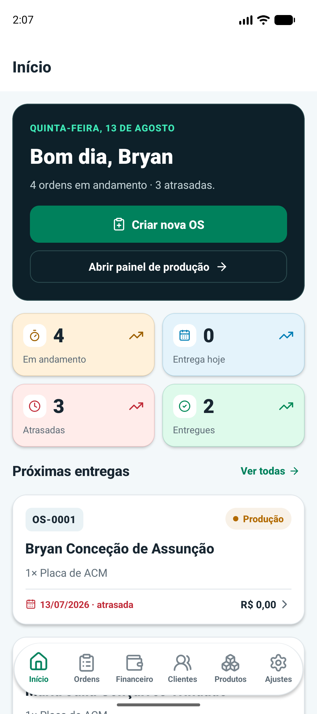
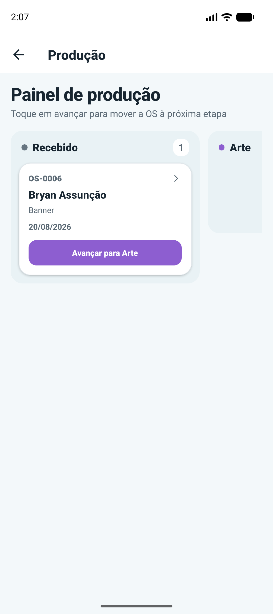
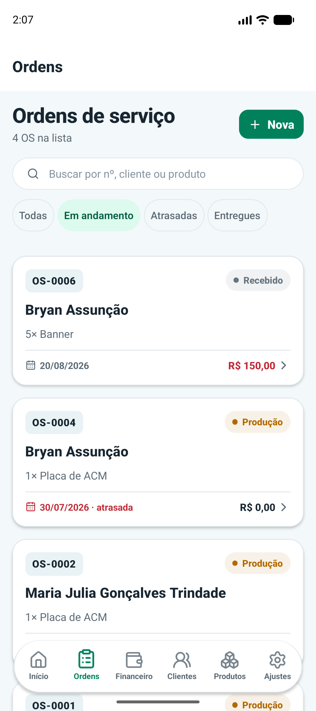
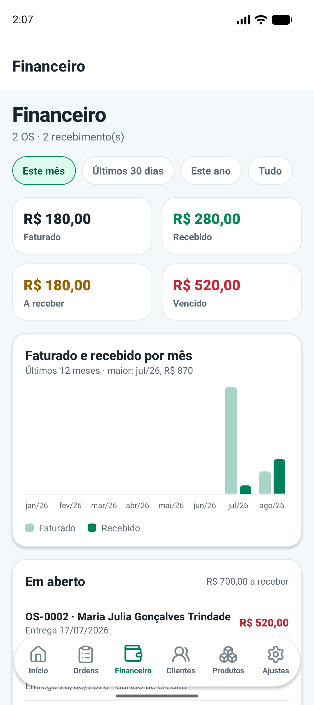

<div align="center">
  

  <h1>Fluxo</h1>

  <p><strong>Ordens de serviço, produção e financeiro.<br />Tudo no mesmo fluxo.</strong></p>

  <p>
    Plataforma web e mobile criada para a rotina de empresas de comunicação visual.
  </p>

  <p>
    <a href="https://fluxo.web.app"><strong>Conhecer o Fluxo ↗</strong></a>
    &nbsp;&nbsp;·&nbsp;&nbsp;
    <a href="#demonstração">Acessar demonstração</a>
    &nbsp;&nbsp;·&nbsp;&nbsp;
    <a href="#tecnologia">Tecnologia</a>
  </p>

  <p>
    
    
    
    
  </p>
</div>

---

## O produto

O **Fluxo** conecta atendimento, produção e financeiro em uma única operação.
Uma OS nasce no balcão, avança pelo painel de produção e termina com entrega e
recebimento registrados — sem planilhas paralelas ou atualização duplicada.

Cada empresa utiliza sua própria instalação Firebase, com usuários e dados
totalmente isolados.

## O Fluxo em ação

<table>
  <tr>
    <td width="50%" align="center">
      <strong>1. Visão geral</strong><br />
      <sub>Indicadores, atrasos e próximas entregas logo na entrada.</sub>
    </td>
    <td width="50%" align="center">
      <strong>2. Produção</strong><br />
      <sub>A OS avança de etapa direto pelo celular.</sub>
    </td>
  </tr>
  <tr>
    <td align="center">
      
    </td>
    <td align="center">
      
    </td>
  </tr>
  <tr>
    <td width="50%" align="center">
      <strong>3. Ordens e prazos</strong><br />
      <sub>Busca, filtros, status e alertas em uma única lista.</sub>
    </td>
    <td width="50%" align="center">
      <strong>4. Financeiro</strong><br />
      <sub>Faturado, recebido, vencido e evolução mensal.</sub>
    </td>
  </tr>
  <tr>
    <td align="center">
      
    </td>
    <td align="center">
      
    </td>
  </tr>
</table>

<p align="center"><sub>Capturas PNG feitas diretamente no aplicativo Android em execução, sem reconstrução ou edição por IA.</sub></p>

## Demonstração

<table>
  <tr>
    <td><strong>Aplicação</strong></td>
    <td><a href="https://fluxo.web.app">fluxo.web.app</a></td>
  </tr>
  <tr>
    <td><strong>E-mail</strong></td>
    <td><code>teste@teste.com</code></td>
  </tr>
  <tr>
    <td><strong>Senha</strong></td>
    <td><code>contatest*</code></td>
  </tr>
</table>

> Ambiente destinado à demonstração. Cadastre somente informações fictícias.

## Do orçamento à entrega

```text
Recebido  →  Arte  →  Produção  →  Pronto  →  Entregue
```

1. **Atendimento:** cadastra o cliente e monta a OS com produtos, medidas, valores e prazo.
2. **Produção:** acompanha a fila e movimenta o pedido entre as etapas.
3. **Relacionamento:** consulta o histórico e chama o cliente pelo WhatsApp.
4. **Entrega:** gera ou compartilha a OS em PDF.
5. **Financeiro:** registra cada recebimento e acompanha saldo, vencimento e margem.

## Uma operação completa

<table>
  <tr>
    <td width="33%" valign="top">
      <strong>Atendimento</strong><br /><br />
      Clientes e produtos<br />
      Consulta de CEP e CNPJ<br />
      Cálculo por m² ou unidade<br />
      Numeração automática<br />
      Link externo da arte
    </td>
    <td width="33%" valign="top">
      <strong>Produção</strong><br /><br />
      Kanban em tempo real<br />
      Arrastar e soltar<br />
      Suporte a toque<br />
      Alertas de prazo<br />
      Histórico de status
    </td>
    <td width="33%" valign="top">
      <strong>Gestão</strong><br /><br />
      Faturado e recebido<br />
      Valores em aberto<br />
      Margem por período<br />
      Exportação contábil<br />
      Auditoria de alterações
    </td>
  </tr>
</table>

### Recursos que fazem diferença no dia a dia

- Busca por número da OS, cliente ou produto.
- Filtros por etapa, atraso e entrega.
- Recebimentos individuais com data, forma e observação.
- PDF da ordem de serviço para impressão ou compartilhamento.
- WhatsApp com mensagem contextual conforme a etapa do pedido.
- Cancelamento que preserva histórico e numeração.
- Exclusão recuperável de clientes e produtos.
- Cache da última sessão e sincronização ao reconectar.
- Temas claro e escuro e interface responsiva.

## Web e aplicativo, o mesmo produto

O site oferece a visão ampla da operação. O aplicativo leva as tarefas mais
frequentes para o balcão e para a produção. Os dois consomem os mesmos dados e o
mesmo domínio TypeScript, evitando divergências de preço, saldo e validação.

```text
┌─────────────────┐       ┌─────────────────────┐
│ Site React/Vite │       │ App Expo/React Native│
└────────┬────────┘       └──────────┬──────────┘
         └──────────────┬────────────┘
                        │
               Domínio compartilhado
                        │
     Firebase Auth · Firestore · Storage · Functions
```

## Tecnologia

| Área | Stack |
|---|---|
| Web | React 19, TypeScript e Vite |
| Mobile | Expo, React Native e Expo Router |
| Plataforma | Firebase Authentication, Firestore, Storage e Hosting |
| Back-end | Cloud Functions v2 com Node.js 22 |
| Qualidade | Vitest, Testing Library, testes de regras e CI/CD |

### Segurança e confiabilidade

- Regras testadas para Firestore e Storage.
- Operações sensíveis executadas por Cloud Functions.
- Autoria e horário registrados nas alterações importantes.
- Exclusões recuperáveis e trilha protegida para auditoria.
- Instalação, backup e recuperação independentes por empresa.

---

<div align="center">
  <p><strong>Fluxo</strong> — da entrada do pedido à entrega.</p>
  <p><a href="https://fluxo.web.app">Abrir demonstração ↗</a></p>
  <sub>Este repositório apresenta o produto. O código-fonte é privado.</sub>
</div>
