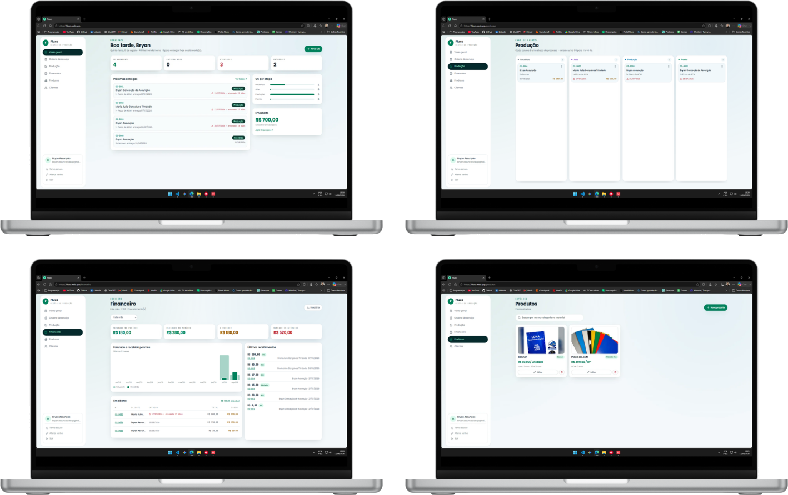
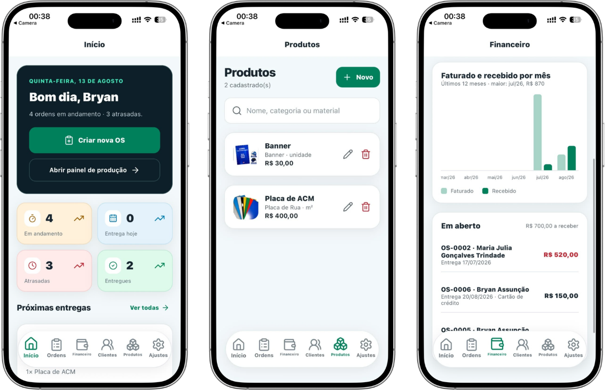
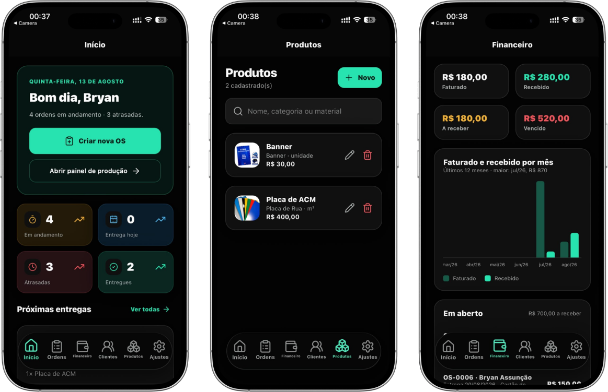

<div align="center">

  

  <h1>Fluxo</h1>

  <h3>Da ordem de serviço ao financeiro, tudo no mesmo fluxo.</h3>

  <p>
    Sistema de gestão para empresas de comunicação visual.<br/>
    Organize vendas, produção, clientes e financeiro em um único lugar.
  </p>

  <br />
  
  <a href="https://fluxo.web.app"></a>
  &nbsp;
  <a href="https://drive.google.com/file/d/1dPtCzoeGLx6bnFy84FViZ9FTgyd3-jNX/view?usp=drive_link"></a>

  <sub>
    🔑 <strong>Acesso de demonstração:</strong>
    <code>teste@teste.com</code>
    &nbsp;•&nbsp;
    <code>contatest*</code>
  </sub>

  <br />
  <br />

<a href="#-visão-geral">Visão Geral</a>
 •  <a href="#-recursos">Recursos</a>
 •  <a href="#-aplicativo-mobile">Mobile</a>
 •  <a href="#-acesso-à-demonstração">Demonstração</a>
 •  <a href="#-tecnologias">Tecnologias</a>

</div>

<br />

---

## 🖥️ Visão Geral

O **Fluxo** foi desenvolvido para centralizar a operação de empresas de comunicação visual em um único sistema.

Da criação de uma ordem de serviço até a produção, entrega e controle financeiro, todas as etapas permanecem conectadas e atualizadas em tempo real.

O objetivo é substituir controles espalhados entre **planilhas, anotações, mensagens e sistemas diferentes** por um fluxo de trabalho único, simples e organizado.

<br />

<div align="center">
  
</div>

<br />

### Tudo começa em uma OS.

```text
Cliente
   ↓
Ordem de Serviço
   ↓
Produção
   ↓
Finalização
   ↓
Entrega
   ↓
Financeiro
```

Cada etapa acompanha a anterior, mantendo informações comerciais, operacionais e financeiras conectadas durante todo o processo.

---

## 💻 Recursos

<table>
<tr>
<td width="50%" valign="top">

### 📋 Ordens de Serviço

Crie e acompanhe ordens de serviço com todas as informações necessárias para execução do trabalho.

* Cadastro de clientes
* Medidas e especificações
* Cálculo automático de valores
* Prazos de entrega
* Status da OS
* Geração de PDF

</td>
<td width="50%" valign="top">

### ⚙️ Linha de Produção

Visualize exatamente em qual etapa cada serviço está e mantenha toda a equipe alinhada.

* Gestão visual estilo Kanban
* Etapas personalizadas
* Atualizações em tempo real
* Controle de prazos
* Alertas de atraso
* Histórico operacional

</td>
</tr>

<tr>
<td width="50%" valign="top">

### 📊 Financeiro

Acompanhe a saúde financeira da operação sem precisar manter controles paralelos.

* Faturamento
* Contas a receber
* Valores em aberto
* Inadimplência
* Projeção mensal
* Indicadores financeiros

</td>
<td width="50%" valign="top">

### 💬 Clientes & WhatsApp

Centralize as informações comerciais e facilite o contato com seus clientes.

* Cadastro de clientes
* Histórico de contatos
* Informações centralizadas
* Acesso rápido ao WhatsApp
* Acompanhamento comercial

</td>
</tr>

<tr>
<td width="50%" valign="top">

### 🎨 Interface Adaptativa

Uma experiência pensada tanto para quem trabalha no escritório quanto para quem acompanha a produção.

* Tema claro
* Tema escuro
* Layout responsivo
* Desktop e mobile

</td>
<td width="50%" valign="top">

### 🔒 Empresas Independentes

Cada empresa possui seu próprio ambiente dentro do Fluxo.

* Dados isolados por empresa
* Autenticação individual
* Controle de acesso
* Estrutura multitenant

</td>
</tr>
</table>

---

## 📱 Aplicativo Mobile

O Fluxo também acompanha a operação fora do computador.

O aplicativo foi pensado principalmente para **consultas rápidas e acompanhamento da produção**, permitindo que informações importantes estejam disponíveis para a equipe diretamente pelo celular.

As alterações realizadas no sistema são sincronizadas em tempo real entre web e aplicativo.

<br />

<p align="center">
  
</p>

<details>
  <summary><strong>🌙 Visualizar interface no tema escuro</strong></summary>

  <br />

  <p align="center">
    
  </p>

</details>

---

## ⚡ Acesso à Demonstração

Quer conhecer o Fluxo na prática?

Utilize o ambiente de demonstração para explorar o sistema pela versão web ou pelo aplicativo Android.

<br />

|     | Plataforma             | Acesso                                                                                                |
| :-: | :--------------------- | :---------------------------------------------------------------------------------------------------- |
|  🌐 | **Painel Web**         | [Acessar fluxo.web.app ↗](https://fluxo.web.app)                                                      |
|  🤖 | **Aplicativo Android** | [Baixar APK ↗](https://drive.google.com/file/d/1dPtCzoeGLx6bnFy84FViZ9FTgyd3-jNX/view?usp=drive_link) |

### Credenciais

| E-mail            | Senha        |
| :---------------- | :----------- |
| `teste@teste.com` | `contatest*` |

> [!NOTE]
> O mesmo usuário pode ser utilizado tanto no painel web quanto no aplicativo Android.

> [!WARNING]
> Este é um ambiente compartilhado de demonstração. Utilize apenas dados fictícios durante os testes.

> [!TIP]
> Para instalar o APK no Android pode ser necessário permitir a instalação de aplicativos de fontes externas nas configurações do dispositivo.

---

## 🛠 Tecnologias

O Fluxo foi construído com uma stack moderna, compartilhando tecnologias entre a experiência web e mobile.

<div align="center">


</div>

---

<div align="center">

  

  <br />
  <br />

<strong>Fluxo</strong>

  <br />

<sub>Gestão para empresas de comunicação visual.</sub>

  <br />
  <br />

  <sub>
    Repositório demonstrativo • Código-fonte proprietário
  </sub>

</div>
